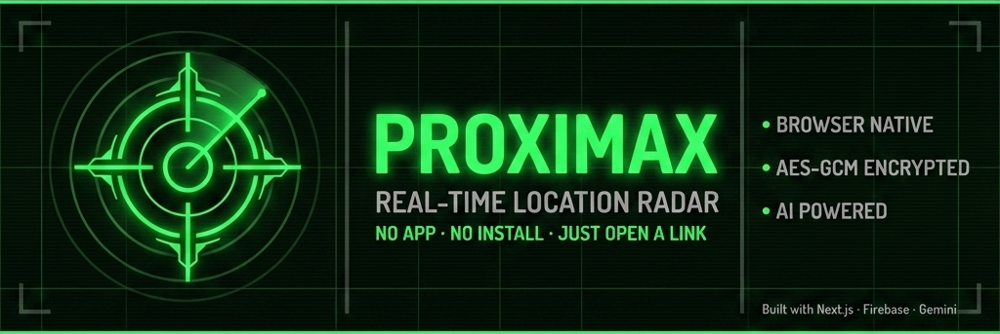

# 📡 ProximaX — Real-Time Location Radar

<div align="center">



**NO APP. NO INSTALL. JUST OPEN A LINK.**

[](https://project-radar-hazel.vercel.app)
[](https://project-radar-hazel.vercel.app)
[](https://nextjs.org)
[](https://firebase.google.com)
[](https://ai.google.dev)
[](LICENSE)

</div>

---

**ProximaX** is a *consent-based real-time location radar* that runs entirely in the browser. No download. No signup. No app store. Share a link — your group appears on a live military-style HUD radar with AI-powered situation reports and natural language commands.

It works on any phone, tablet, or desktop. Open the link. Pick your name. Start sharing. That's it.

**Built for:** trekking groups · event crews · festival coordination · emergency response · anyone tracking people across a physical space.

---

## ✨ Features

**🗺 Real-Time Radar HUD** — Military-style radar with sweep animation and a live Leaflet map. Every peer appears as a colored dot, updating in real time as they move.

**🤝 Consent First** — No one is tracked without agreeing. Every participant sees a clear consent screen before their GPS activates. Stop sharing anytime — you vanish from the radar instantly.

**🔔 Proximity Alerts** — Set an alert radius. Get an instant banner notification and a push alert when someone enters your zone — even if the tab is in the background.

**🆘 Emergency SOS** — Any participant can trigger an SOS beacon with one tap. Everyone in the room gets an immediate push notification. The radar highlights the emergency live.

**🧠 AI Situation Reports** — Every 30 seconds an AI analyst reads the radar and delivers a live situation summary, anomaly detection, and a threat level: `LOW` · `MEDIUM` · `HIGH`.

**🗣 Natural Language Commands** — Control the radar by typing plain English:
- *"zoom in on Priya"*
- *"set alert radius to 300 meters"*
- *"tell everyone to head to the entrance"*
- *"who is closest to me?"*

**📲 Browser-Native — No App Needed** — Runs in any modern browser on Android, iPhone, desktop, or tablet. Optionally installable to your home screen with background push notifications — without touching an app store.

---

## 🛠 Tech Stack

| Layer | Technology |
|---|---|
| Framework | Next.js 14 App Router |
| Language | TypeScript |
| Real-Time Sync | Firebase Realtime Database |
| Map | Leaflet |
| Styling | Tailwind CSS |
| Push Notifications | Web Push / VAPID |
| AI | Google Gemini 2.5 Flash |
| Hosting | Vercel |

---

## 🚀 Getting Started

### Prerequisites
- Node.js 18+
- A [Firebase project](https://console.firebase.google.com) with Realtime Database enabled
- A [Gemini API key](https://ai.google.dev) — free, no credit card
- VAPID keys for push notifications

### Clone and Install

```bash
git clone https://github.com/GuruGouthamKanchi/project-radar
cd project-radar
npm install --legacy-peer-deps
```

### Generate VAPID Keys

```bash
npx web-push generate-vapid-keys
```

### Configure Environment

Create a `.env.local` file:

```env
NEXT_PUBLIC_FIREBASE_API_KEY=
NEXT_PUBLIC_FIREBASE_AUTH_DOMAIN=
NEXT_PUBLIC_FIREBASE_DATABASE_URL=
NEXT_PUBLIC_FIREBASE_PROJECT_ID=
NEXT_PUBLIC_FIREBASE_STORAGE_BUCKET=
NEXT_PUBLIC_FIREBASE_MESSAGING_SENDER_ID=
NEXT_PUBLIC_FIREBASE_APP_ID=

NEXT_PUBLIC_VAPID_PUBLIC_KEY=
VAPID_PUBLIC_KEY=
VAPID_PRIVATE_KEY=
VAPID_MAILTO=mailto:you@email.com

GEMINI_API_KEY=
CLEANUP_SECRET=
```

### Deploy Firebase Rules

```bash
firebase deploy --only database
```

### Run

```bash
npm run dev
```

Open [http://localhost:3000](http://localhost:3000)

---

## 🔒 Privacy & Security

- **Consent required** — no one shares location without explicitly agreeing
- **Session-only** — location data is deleted the moment a peer stops sharing or closes the tab
- **Validated writes** — every payload is validated client-side and enforced at the database level
- **No persistent tracking** — rooms inactive for 24 hours are automatically cleaned up
- **Server-side AI** — your Gemini API key never touches the browser
- **Rate-limited push** — notification API is protected against spam and abuse

---

## 🤝 Contributing

Contributions are welcome. Please open an issue first to discuss what you'd like to change.

1. Fork the repository
2. Create your branch: `git checkout -b feature/your-feature`
3. Commit: `git commit -m 'feat: describe your change'`
4. Push: `git push origin feature/your-feature`
5. Open a Pull Request

---

## 📄 License

MIT — see [LICENSE](LICENSE) for details.

---

## 👨‍💻 Author

<a href="https://github.com/GuruGouthamKanchi">
  
</a>

**GuruGouthamKanchi**

<!-- <div align="center">

Built by [GuruGouthamKanchi](https://github.com/GuruGouthamKanchi)

</div> -->
